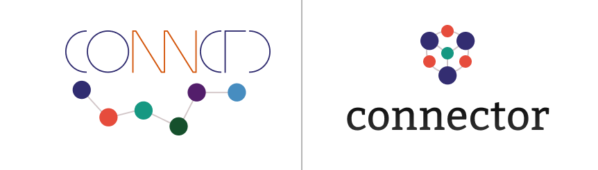

  

The Giphy connector connects Giphy to the connctd IoT platform.
Its main use case is to demonstrates the usage of the [connector-go](https://github.com/connctd/connector-go) SDK to implement a connector for the [connctd platform](https://docs.connctd.io/).
It is accompanied by a [tutorial](https://github.com/connctd/giphy-connector/blob/sdk-tutorial/Tutorial.md) explaining the necessary steps to implement a connector with the SDK.
<!-- Add link to published tutorial -->

See the [connector documentation](https://docs.connctd.io/connector/connectors/) and the [connctd tutorials](https://tutorial.connctd.io/) for more details on Connectors and the connctd platform.
If you want to implement a connector without the SDK or are interested in the connector protocol, you should also read the [connector protocol documentation](https://docs.connctd.io/connector/connector_protocol/).

## Usage and requirements

This connector connects the Giphy API to the connctd IoT platform.
Therefore you need an account for the [connctd Developer Center](https://devcenter.connctd.io/).

Using the Giphy API requires an account with Giphy and a Giphy API key.
See the [Giphy documentation](https://developers.giphy.com/docs/api#quick-start-guide) on how to acquire them.

The connector implements the connctd connector protocol to demonstrate connector development.
If you are not interested in connector development and only want to use the connector, you can also install the public publication from the [Developer Center](https://devcenter.connctd.io/).
<!-- TODO: Add link to connector publication -->

To publish your own version of the connector, it must be reachable via HTTP from the connctd platform.
You can deploy it on a hosting provider of your choice or run it locally and expose the local instance with tools like [ngrok](https://ngrok.com/).

The connector can be build with the provided Makefile (`make build`).
To run the connector the environment variable `GIPHY_CONNECTOR_PUBLIC_KEY` must be set to your Giphy API key.
You can also add the API key to `run.sh` and simply run this script to start the connector.

By default the connector uses a Sqlite database which does not need any configuration.
The SDK also supports Postgresql and Mysql.
You have to modify `main.go` in order to use them.
You can find an example for Mysql in `main.go`.
To initially create the database layout the connector should be started with the `-migrate` flag on its first run.
See `run.sh` for an example on how to do this.
